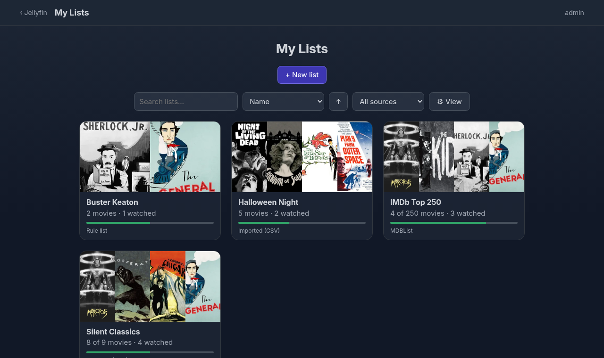
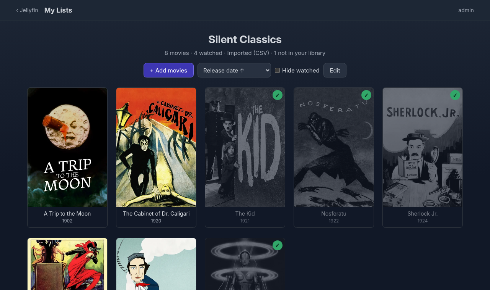
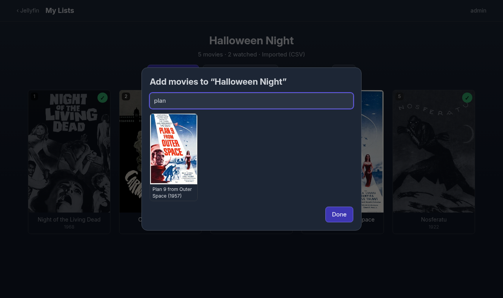
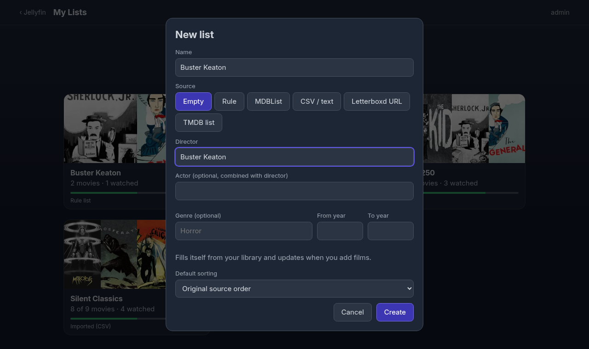
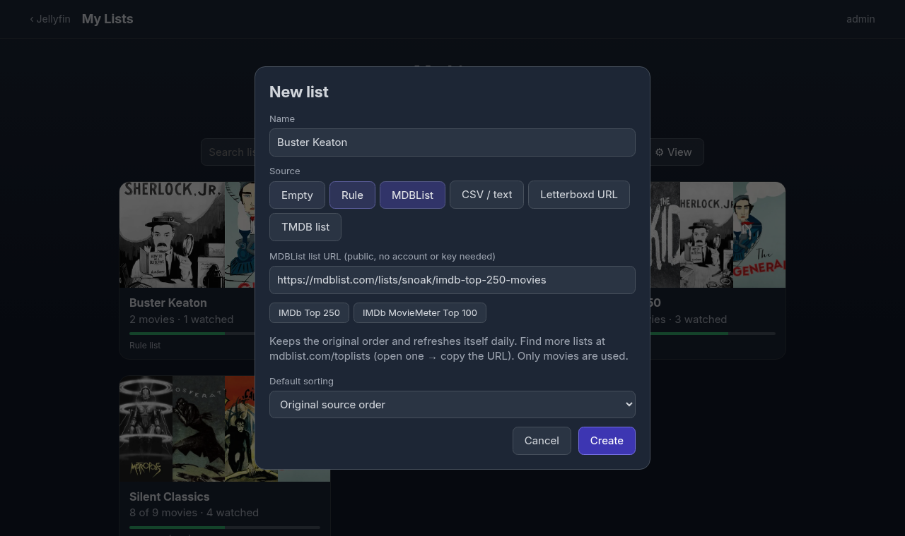
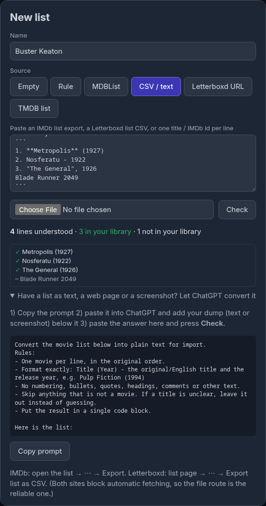
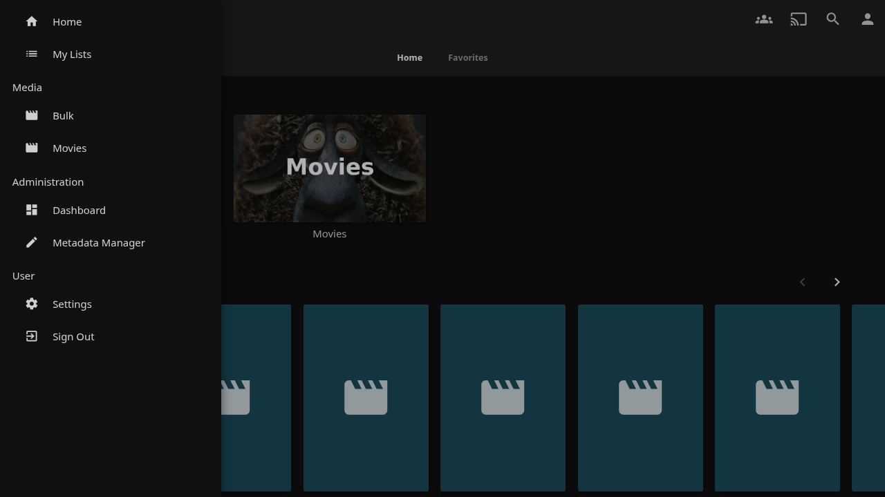

# My Lists: watch-checklists for Jellyfin

**Make a list like "IMDb Top 250" or "all films by Tarantino", keep it in order, and see at a glance which ones you have already seen.**
Watched movies stay in the list, greyed out with a green check, instead of disappearing like in a watchlist.

Jellyfin's playlists and collections can't do this: a playlist is for *playing* things in a row, a collection is a
tag on movies, and neither shows you "I have seen 142 of these 250". My Lists is a new sidebar entry for exactly that.

- **Chase a ranking**: import the IMDb Top 250 (or any [MDBList](https://mdblist.com/toplists/) list) and tick them off in IMDb order.
- **Follow a filmmaker**: "Director = Christopher Nolan" fills itself from your library and grows when you add films.
- **Share taste**: paste a friend's "top 10 horror" (text, IMDb or Letterboxd export) and see which ones you own and haven't watched.
- **Your own order**: sort by release date, rating or title, drag to rearrange, **Save this order**. Each user has their own lists and their own greyed-out state.

| | |
|---|---|
|  |  |

## Features

- **Lists per Jellyfin user.** Watched state comes live from Jellyfin, so two users see the same list greyed out differently.
- **Four ways to fill a list**
  - **Empty / manual**: search your library and click movies (`+ Add movies`).
  - **Rule**: all movies of a *director* and/or *actor*, optional genre and year range. Fills and updates itself. The person's real role is checked (a film where Nolan is only producer is not "directed by Nolan").
  - **MDBList**: paste a public list URL, e.g. the IMDb Top 250. No account or key. Keeps the source order and refreshes daily.
  - **Text / CSV**: IMDb list export, Letterboxd export, or one title per line (see below).
- **Sorting**: original source order, saved order, release date ↑/↓, title, rating, runtime, unwatched first. Hide watched. Drag & drop, then **Save this order**. The source order is never lost; the saved order is stored separately.
- **Movies not in your library** are remembered and listed under "not in your library". They appear as soon as you add them.
- **Custom cover** per list (PNG/JPEG/WebP, 5 MB) or an automatic poster collage.
- **Sidebar entry** "My Lists" (needs the File Transformation plugin) and the page at `/MyLists/`. Styled after the ElegantFin theme, dark, works on phones.



## Install

Requirements: Jellyfin **10.11.x** (tested on 10.11.11). A build for 12.x compiles but has **not been run** against a 12 server.
For the sidebar entry install the [File Transformation](https://github.com/IAmParadox27/jellyfin-plugin-file-transformation) plugin; without it everything works at `http://<server>:8096/MyLists/`.

1. `scripts/package.sh` (needs the .NET 9 SDK) builds `dist/MyLists-<version>.1011-jellyfin-10.11.zip`.
2. Unzip into `<jellyfin config>/plugins/My Lists_<version>.1011/` (the folder name must contain the version), restart Jellyfin.
3. Open **My Lists** in the sidebar or `/MyLists/`.

Optional settings (Dashboard → Plugins → My Lists): hide the sidebar entry, TMDB API key (only for TMDB list import).

## Creating lists

 

### From MDBList
Open mdblist.com/toplists, open a list, copy its URL (`https://mdblist.com/lists/<user>/<list>`), paste it. Presets for the IMDb Top 250 and MovieMeter are built in.
The plugin reads the public JSON of the list (`<url>/json`). Only movies are used; shows are ignored.

### From text or a file (IMDb, Letterboxd, anything)
IMDb and Letterboxd block automatic requests from servers, and neither offers a usable free API for this, so the reliable route is a file or pasted text:

- **IMDb**: open your list, `⋯ → Export`, paste or upload the CSV. IMDb ids are matched exactly.
- **Letterboxd**: list page → `⋯ → Export list as CSV` (or the watchlist export).
- **Anything else** (a web page, a screenshot, a forum post): let ChatGPT convert it. The dialog has a **Copy prompt** button; paste it into ChatGPT together with your dump, then paste the answer into the text box and press **Check**.



Accepted lines (messy assistant output such as numbering, bullets, bold or code fences is cleaned up):

```
Pulp Fiction (1994)
Jackie Brown, 1997
Reservoir Dogs - 1992
tt0114369
```

**Check** shows how every line was understood and whether the movie is in your library, before anything is created. Prefer `Title (Year)` over ids when ChatGPT wrote the list: assistants sometimes invent ids.

There is also a best-effort *Letterboxd URL* source and a *TMDB list* source (needs a TMDB key); Letterboxd usually answers 403 to servers, then use the CSV.

### Matching
IMDb id first, then TMDB id, then title + year (±1 year), accents/case/punctuation ignored. A title without a year only matches if it is unique in your library.

## Use



Click a poster to open the movie in Jellyfin. `Edit` renames, changes the rule, adds more text, re-syncs, sets the cover or deletes the list (your movies are never touched). `Use as default sorting` stores the current sort for the list.

## Data & privacy

- Lists live in `<jellyfin data>/plugins/MyLists/lists.json`, covers in `…/covers/`. Back these up. A corrupt file is kept as `lists.json.corrupt-<time>` instead of being overwritten.
- All API calls need a signed-in Jellyfin user and only ever touch that user's lists.
- Cover images are served without a token (an `` cannot send one). The file name contains the random list GUID, so it cannot be guessed, but anyone who has the link can view the image.
- Outgoing requests happen only for MDBList / Letterboxd / TMDB sources you create.

## Limitations

- Web client only (browser, Jellyfin Media Player and other web-based clients). Native Android TV / Swiftfin / Roku apps do not know the page.
- Movies only, no series.
- A rule needs the **full person name** as stored in Jellyfin's metadata; a movie whose metadata lacks the director entry will not match.
- The movie index is cached per user and rebuilt when your library changes (a few hundred ms for ~2,000 movies, once); only watched state is read on every load. Posters load lazily.
- Jellyfin 12 build is untested at runtime; 10.9 / 10.10 are not supported.

## Development

```bash
dotnet build src/Jellyfin.Plugin.MyLists -c Release                 # 10.11 (net9.0)
dotnet build src/Jellyfin.Plugin.MyLists -c Release -p:JellyfinTarget=12
dotnet test tests/MyLists.Tests                                     # parser unit tests
dev/demo-server.sh 10.11.11 28300       # throw-away Jellyfin in Docker, admin / test, with File Transformation + demo library
npm --prefix dev install playwright-core
CHROME=<path to chrome> node dev/e2e.mjs        # end-to-end test (creates and removes its own lists; needs internet for MDBList)
CHROME=<path to chrome> node dev/screenshots.mjs  # regenerates docs/screenshots
```

More on how it works and why: [docs/ARCHITECTURE.md](docs/ARCHITECTURE.md).

Layout: `src/Jellyfin.Plugin.MyLists` — `Api/MyListsController.cs` (routes), `ListService.cs` (merge/sync/DTOs), `Resolver.cs` (library matching, rules), `Importers.cs` (text/CSV/MDBList/Letterboxd/TMDB), `ListStore.cs` (JSON storage), `Web/` (the page, plain JS, no build step), `SidebarInjector.cs` + `Web/inject.js` (sidebar entry).

## License

GPL-3.0, see [LICENSE](LICENSE).
